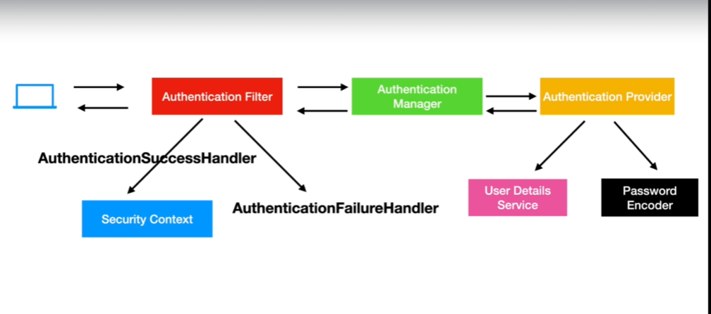
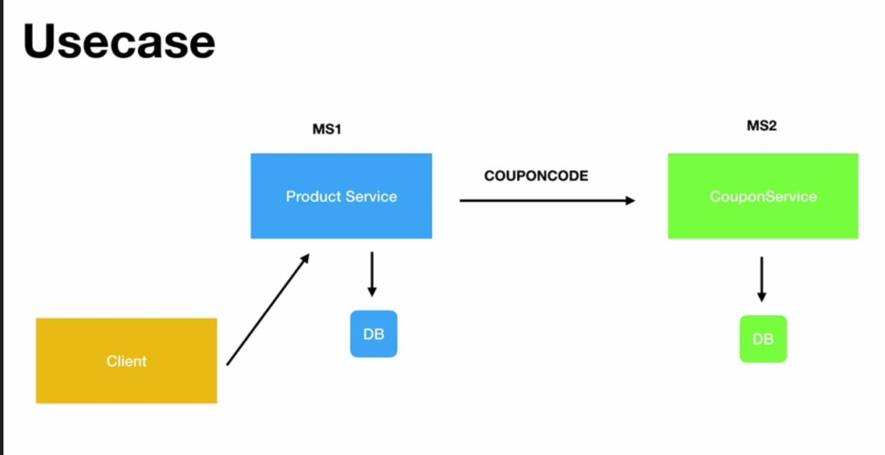
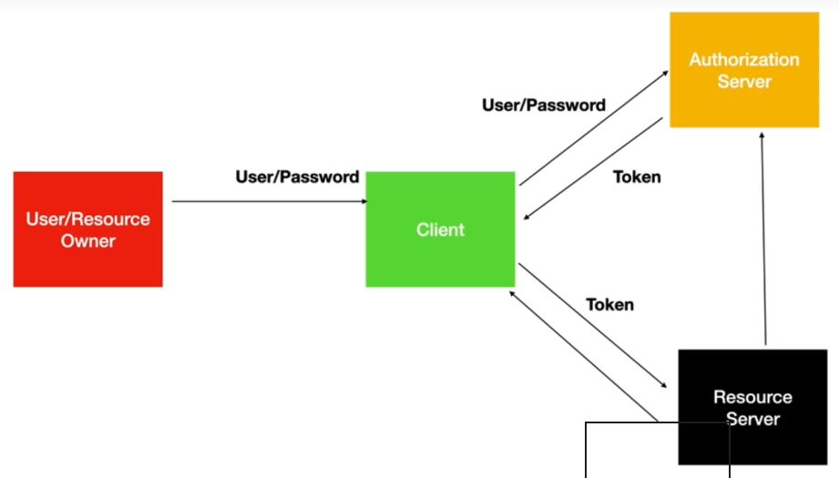
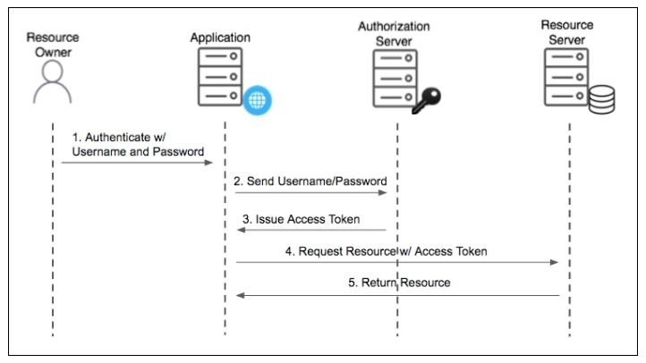
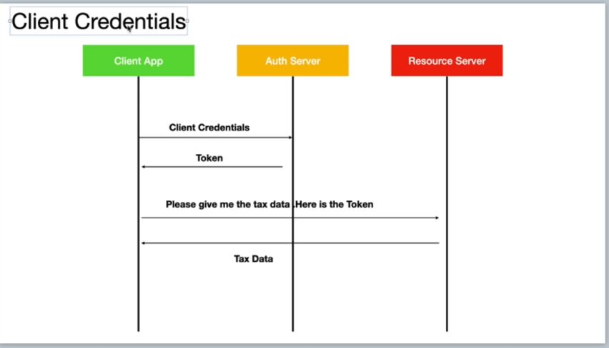
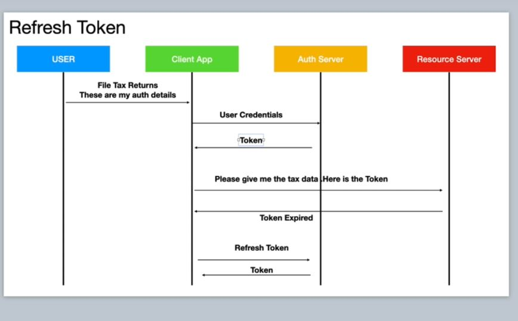
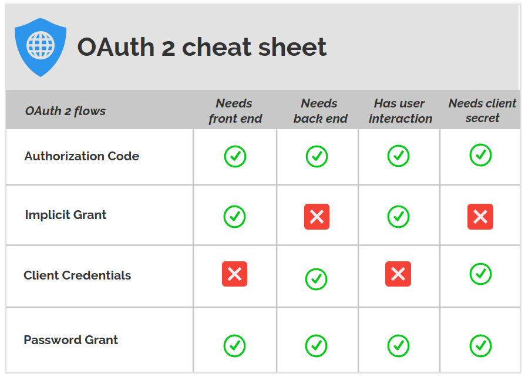

## version 5

## create microservices with spring security

## key security components

## usecase: 

### create coupon service
[https://cognizant.udemy.com/course/spring-security-fundamentals/learn/lecture/18358034#overview]

1. Run sql queries (tables.sql) to create db,coupon table

    use mydb;

    create table product(
    id int AUTO_INCREMENT PRIMARY KEY,
    name varchar(20),
    description varchar(100),
    price decimal(8,3) 
    );
 
2. create model, repo, controller for coupon table
3. configure data source
4. test
  POST http://localhost:8080/couponapi/coupons/ 
  {
    "code":"SUPERSALE2",
    "discount":"10",
    "expDate":"12/12/2020"
  }
 GET http://localhost:8080/couponapi/coupons/SUPERSALE2  

### create product service

5. Run sql queries (tables.sql) to create db,product table

    create table coupon(
    id int AUTO_INCREMENT PRIMARY KEY,
    code varchar(20) UNIQUE,
    discount decimal(8,3),
    exp_date varchar(100) 
    );

6. create model, repo, controller for product table
7. configure data source
8. test
  POST http://localhost:9090/productapi/products/ 
  {
    "name":"iPhone",
    "description":"Awesome",
    "price": 10
  }

 Go to mysql to check if data is added

 ### integrate both api

9. add dto model for coupon
10. reconfigure controller for product api to fetch from coupon api 
11. reconfigure product model
12. reconfigure data source
13. add rest template beans in main method
14. test!
    POST http://localhost:9090/productapi/products/ 
  {
    "name":"android",
    "description":"Awesome",
    "price": 10000,
    "couponCode":"SUPERSALE"
  }

  depending on the coupon code, it will minus off and the price will reflect the adjusted price.

### secure rest api for coupon api

15. create table for role, user, user_role

  CREATE TABLE USER 
  (
  ID INT NOT NULL AUTO_INCREMENT,
  FIRST_NAME VARCHAR(20),
  LAST_NAME VARCHAR(20),
  EMAIL VARCHAR(20),
  PASSWORD VARCHAR(256), 
  PRIMARY KEY (ID),
  UNIQUE KEY (EMAIL)
  );

  CREATE TABLE ROLE 
  (
  ID INT NOT NULL AUTO_INCREMENT,
  NAME VARCHAR(20),
  PRIMARY KEY (ID)
  );

  CREATE TABLE USER_ROLE(
  USER_ID int,
  ROLE_ID int,
  FOREIGN KEY (user_id)
  REFERENCES user(id),
  FOREIGN KEY (role_id)
  REFERENCES role(id)
  );

16. add data

  insert into user(first_name,last_name,email,password) values ('doug','bailey','doug@bailey.com','$2a$10$U2STWqktwFbvPPsfblVeIuy11vQ1S/0LYLeXQf1ZL0cMXc9HuTEA2');
  insert into user(first_name,last_name,email,password) values ('john','ferguson','john@ferguson.com','$2a$10$YzcbPL.fnzbWndjEcRkDmO1E4vOvyVYP5kLsJvtZnR1f8nlXjvq/G');

  insert into role values(1,'ROLE_ADMIN');
  insert into role values(2,'ROLE_USER');

  insert into user_role values(1,1);
  insert into user_role values(2,2);

17. test in mysql if data is added  
18. add security dependencies in copuon  
19. create user, role, user_role in coupon api  
20 define relationship in the above 2 entities    
21. create repo  
21. implement userdetailsservice  
22. implement web security config  
23. test - using the credentials

  doug is admin - can get & add
   doug@bailey.com, doug

  john is user - can get only
    john@ferguson.com, john

    POST http://localhost:8080/couponapi/coupons/ 
  {
    "code":"SUPERSALE2",
    "discount":"10",
    "expDate":"12/12/2020"
  }

    GET http://localhost:8080/couponapi/coupons/SUPERSALE2  

### OAuth

`Grant types`

1. Authorization code

  The Authorization Code grant type is used by confidential and public clients to exchange an authorization code for an access token.

  After the user returns to  the client via the redirect URL, the application will get the authorization code from the URL and use it to request an access token.

2. password (This password grant type is for highly trusted apps where      resource owners share their credentials directly with the app)

3. client credentials

  The Client Credentials grant type is used by clients to obtain an access token outside of the context of a user.

  This is typically used by clients to access resources about themselves rather than to access a user's resources.

4. refresh token

  The Refresh Token grant type is used by clients to exchange a refresh token for an access token when the access token has expired.

  This allows clients to continue to have a valid access token without further interaction with the user.

  

5. summary

  

### oauth in action

1. add maven dependencies
2. OAuth2SecurityConfig class will replace WebSecurityConfig as the security configuration
3. create auth server - AuthorizationServerConfig class
4. create resource server

